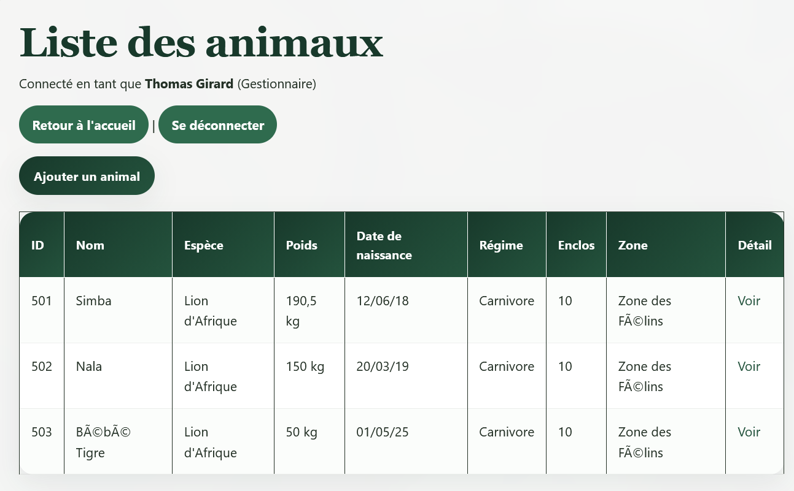
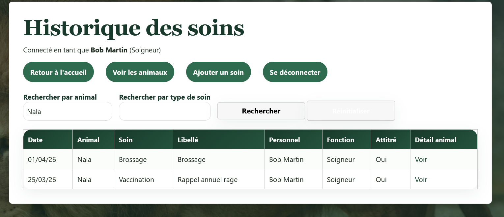
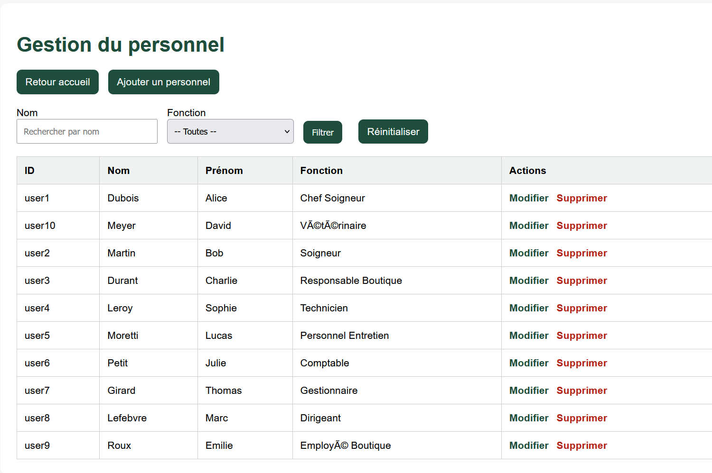
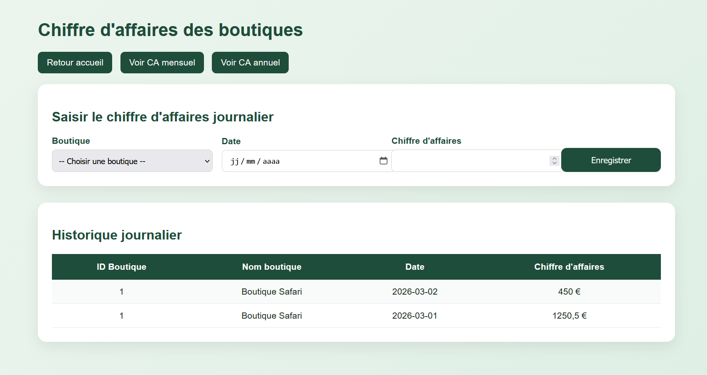
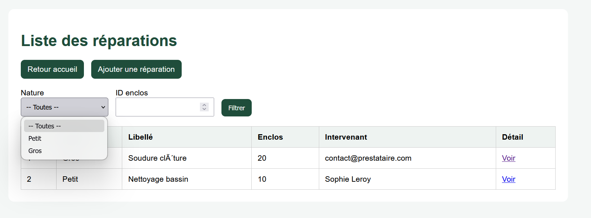

# site-Zoo
gestion complète d’un parc zoologique développé en PHP et Oracle SQL, intégrant gestion des animaux, personnel, soins, boutiques, chiffre d’affaires, réparations et parrainages, avec système sécurisé par rôles et sessions
# 🦁 ZooLand — Système de gestion de zoo (PHP / Oracle SQL)

Projet universitaire de développement d’une application web complète dédiée à la gestion d’un parc zoologique.

---

## 📌 Présentation

ZooLand est une plateforme permettant :

- la gestion des animaux
- la gestion du personnel
- la gestion des enclos
- la gestion des soins
- la gestion des nourrissages
- la gestion des boutiques
- le suivi du chiffre d’affaires
- la gestion des réparations
- la gestion des parrainages

L’objectif est de centraliser toutes les activités du zoo dans une seule application sécurisée.

---

## 🛠️ Technologies utilisées

- PHP
- Oracle SQL
- OCI8
- HTML5
- CSS3
- JavaScript
- Sessions PHP

---

## 🔐 Sécurité

- Authentification sécurisée par session
- Gestion des rôles utilisateurs
- Requêtes préparées avec `oci_bind_by_name`
- Hashage des mots de passe
- Protection contre les injections SQL
- Protection XSS via `htmlspecialchars`

---

## 👥 Gestion des rôles

Le système adapte automatiquement l’accès selon le rôle :

- Dirigeant
- Gestionnaire
- Responsable Boutique
- Comptable
- Vétérinaire
- Chef Soigneur
- Soigneur

---

## 📸 Captures d’écran

### 🌍 Page d’accueil publique


### 🔐 Connexion sécurisée


### 👑 Tableau de bord principal


### 💛 Système de parrainage


### 🐾 Gestion des animaux


### 💉 Gestion des soins


### 👨‍💼 Gestion du personnel


### 🛍️ Gestion des employés boutique


### 📈 Gestion du chiffre d’affaires


### 🔧 Gestion des réparations


---

## ⚙️ Installation

### 1. Base de données

Exécuter :

```bash
database/bd.sql
